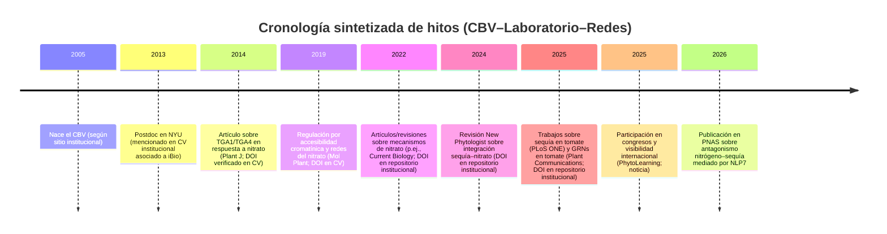
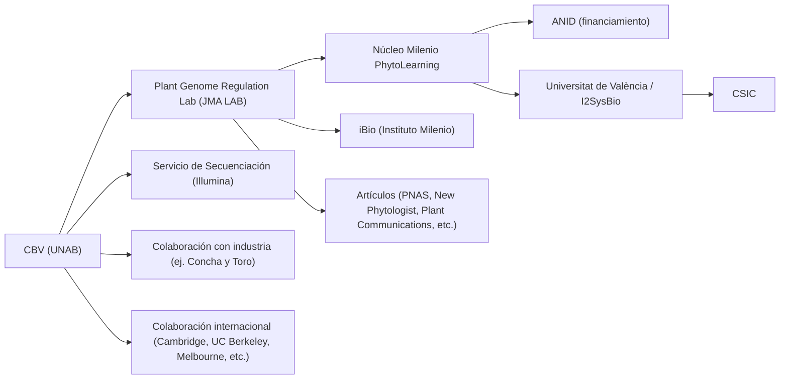

# Investigación profunda sobre el Plant Genome Regulation Lab

## Resumen ejecutivo

El **Plant Genome Regulation Lab / Laboratorio de Regulación del Genoma Vegetal (JMA LAB)** es un grupo de investigación enfocado en **redes regulatorias génicas, señalización y regulación transcripcional/epigenética asociada a estrés hídrico y nutrición nitrogenada**, con un énfasis crecientemente explícito en **estrategias de ciencia de datos** (metaanálisis transcriptómico, “big data” y enfoques de _machine learning_) para identificar nodos reguladores y biomarcadores de estrés. Esta agenda se encuentra alineada con la descripción oficial de líneas del CBV, que incluye (i) respuesta temprana a sequía, (ii) redes regulatorias para adaptación a sequía y nitrógeno mediante big data/ML, (iii) cambios epigenéticos en adaptación a sequía y (iv) biomarcadores moleculares de expresión génica para detección de estrés. citeturn32search1

El laboratorio opera dentro del **Centro de Biotecnología Vegetal (CBV)**, un centro que declara haber nacido en **2005**, alojado en la Facultad de Ciencias de la Vida, con **8 laboratorios** y ~**70 miembros**, y que además mantiene un **servicio de secuenciación** con capacidades Illumina (p. ej., NextSeq 500, MiSeq, MiniSeq) y experiencia en construcción de genotecas y NGS para múltiples aplicaciones. citeturn32search1turn33view1

En términos de articulación institucional y redes, el laboratorio aparece fuertemente conectado al **Núcleo Milenio PhytoLearning**, que se presenta como proyecto financiado por **ANID** y dirigido por su director y directora alterna, y que visibiliza actividades en congresos/foros, cursos (p. ej., programación para ciencias biológicas) y productos de ciencia abierta como **TomViz**, plataforma web para explorar redes génicas en tomate asociadas a un artículo en _Plant Communications_. citeturn49view1turn44view1turn50search3turn43search5

La producción científica asociada al PI (y por extensión a la agenda del laboratorio) muestra contribuciones recientes en revistas de alto impacto y/o alta visibilidad (p. ej., _PNAS_, _New Phytologist_, _Plant Cell and Environment_, _Plant Communications_, _Molecular Plant_), con trabajos que integran análisis transcriptómicos y modelamiento de redes regulatorias para entender decisiones fisiológicas entre crecimiento y tolerancia a sequía bajo señales antagonistas (nitrógeno vs. déficit hídrico), así como construcción de GRNs a partir de grandes volúmenes de datos en tomate. citeturn24view0turn43search5turn41search4turn48view0

En métricas, el perfil institucional del PI en el repositorio de investigadores de la universidad reporta **h-index 21** y **2.087 citas**, calculadas en Pure con soporte de Scopus (según declaración del propio sitio). citeturn15view0  
A nivel del centro (CBV), existe un documento institucional que reporta (a julio 2022) **225 publicaciones** de investigadores principales del CBV y **9.013 citas** (Scopus o WoS), junto con cifras de integrantes y capacidades de infraestructura. citeturn33view1

Limitación relevante: la extracción completa automatizada de “todas las publicaciones” del PI desde el sitio institucional se ve afectada por restricciones técnicas del propio sitio (rutas de listado que devuelven error); por ello, en este informe se documentan publicaciones **identificadas y verificadas** en fuentes primarias accesibles (páginas de publicaciones con DOI, perfiles institucionales, CV institucional y páginas de PhytoLearning), y se explicita cuando algo queda **no especificado**. citeturn15view0turn48view0

## Metodología y fuentes consultadas

La investigación se ejecutó priorizando los sitios solicitados y, luego, ampliando a fuentes académicas y prensa:

- **Orden de partida (web):** phytolearning.cl → ibio.cl → embo.org → unab.cl / cbv.unab.cl. citeturn45view0turn47view0turn0search18turn32search1
- **Fuentes primarias institucionales adicionales:** repositorio de investigadores y publicaciones institucionales (páginas “publications” con DOI), y documento PDF institucional del CBV sobre contribuciones e infraestructura. citeturn24view0turn33view1turn43search5
- **Fuentes primarias académicas indexadas:** PubMed para verificación de DOI/metadata en algunos artículos. citeturn41search0turn41search2
- **Prensa y comunicación científica:** notas institucionales y medios chilenos; por ejemplo, una nota de BioBioChile sobre un hallazgo en _PNAS_ ligado a decisiones crecimiento vs. sequía. citeturn9search7
- **Conector solicitado (Gmail vía api_tool):** se intentó consultar, pero el conector devolvió error de “User input required… non-interactive mode”; por tanto, no se incorporó evidencia desde correos del usuario y se continuó solo con fuentes web/públicas. (No hay citas web asociables a este bloqueo; es una limitación operativa observada durante la sesión).

## Historia, foco científico y líneas de investigación del laboratorio

### Inserción institucional en el CBV

El CBV declara haber nacido el **año 2005** y alojarse en la Facultad de Ciencias de la Vida; además indica que sus ocho laboratorios realizan investigación multidisciplinaria en biología de plantas y organismos asociados (patógenos y benéficos), y que mantienen colaboración internacional con universidades y centros de primer nivel. citeturn32search1

Dentro de la sección de investigación del CBV, se describen explícitamente las líneas del laboratorio en cuatro ejes: (1) mecanismos regulatorios de respuesta temprana a sequía, (2) redes regulatorias génicas para adaptación a sequía y nitrógeno usando big data y _machine learning_, (3) cambios epigenéticos asociados a adaptación a sequía, y (4) biomarcadores moleculares basados en expresión génica para detectar estrés. citeturn32search1

### Trayectoria científica: de redes de nitrógeno a integración nitrógeno–sequía y big data

La evidencia revisada muestra una trayectoria coherente con el foco del laboratorio: desde trabajos de **señalización y redes transcripcionales** asociadas a **nitrato/nitrógeno** (incluyendo identificación de factores de transcripción y cambios de accesibilidad cromatínica) hacia una integración explícita con **sequía/ABA**, y en paralelo una expansión hacia **modelamiento de redes con grandes volúmenes de datos** (tomate) y enfoques de metaanálisis transcriptómico. citeturn48view0turn24view0turn43search5

Como ejemplo contemporáneo, un artículo en _PNAS_ (publicado el **6 de enero de 2026**) reporta regulación antagonista entre señalización de nitrógeno y señalización de déficit hídrico mediada por un factor de transcripción central (NLP7), con un componente fuerte de metaanálisis transcriptómico y modelamiento de redes regulatorias. citeturn24view0turn47view0turn9search7

En paralelo, la agenda de “big data” y redes génicas se refleja en un artículo asociado a _Plant Communications_ (en prensa en 2025, según el repositorio institucional) que infiere **redes reguladoras a nivel de órgano (GRNs)** en tomate usando **más de 10.000 librerías RNA-seq**, y que además se vincula a una plataforma web abierta para exploración de redes (TomViz). citeturn43search5turn49view1turn9search20

### Cronología de hitos

La siguiente cronología sintetiza hitos verificables en fuentes primarias consultadas (cuando un dato no aparece en las fuentes revisadas, se marca como **no especificado**).

El origen del CBV en 2005 y la ubicación en Facultad de Ciencias de la Vida provienen del propio CBV. citeturn32search1  
La referencia a “Postdoc, NYU (2013)” aparece en un CV institucional asociado a iBio, donde se enumeran miembros/postdocs vinculados (incluyendo esa entrada). citeturn48view0turn48view2  
Los hitos 2014–2026 están respaldados por páginas institucionales de publicaciones con DOI y/o CV institucional con DOI explícito. citeturn24view0turn43search5turn37view0turn48view0

## Equipo, estudiantes y exalumnos

### Dirección académica y perfil del PI

El perfil del PI en PhytoLearning lo describe como **Bioquímico y Doctor en Ciencias Biológicas** (mención Genética Molecular y Microbiología, **entity["organization","Pontificia Universidad Católica de Chile","santiago, chile"]**), y como académico de la Facultad de Ciencias de la Vida. citeturn46view0  
El perfil institucional de investigadores reporta su afiliación como “Assistant Professor” en la Life Sciences School y enlaza su ORCID, además de reportar métricas bibliométricas (ver sección de impacto). citeturn15view0

En un CV institucional asociado a iBio (de **entity["people","Rodrigo A. Gutiérrez","plant biologist chile"]**), aparece explícitamente una entrada “José Miguel Alvarez (Postdoc, NYU)” para el año 2013, lo que sugiere una etapa formativa relevante en **entity["organization","New York University","new york, ny, us"]**. citeturn48view0turn48view2  
(La institución de postdoctorado del PI no está descrita en detalle en el perfil de PhytoLearning; por eso se triangula con el CV institucional revisado). citeturn46view0turn48view0

### Equipo visible en PhytoLearning: asistentes y estudiantes asociados al laboratorio

PhytoLearning publica listados nominales de estudiantes y asistentes, incluyendo su adscripción a laboratorio (“Plant Genome Regulation Lab”), lo que permite reconstruir parte del equipo activo o reciente.

En **asistentes de investigación** asociados al laboratorio se listan, entre otros:

- Mauricio Fabián Arias Castro (asistente; formación en entity["organization","Universidad de Chile","santiago, chile"] / magíster),
- Catalina Isabel Cofré Espinoza (asistente),
- Macarena Andrea Muñoz Silva (asistente). citeturn50search1

En **estudiantes** asociados al laboratorio se listan, entre otros:

- Luciano Franco Ahumada Langer (doctorado, UNAB),
- Rimer Mayta Poca (magíster, UNAB),
- Sebastián Ortiz (tesista; entity["organization","Universidad de Chile","santiago, chile"]),
- Rachid Emil Sjoberg Tala (doctorado, UNAB). citeturn50search0

Adicionalmente, una noticia de PhytoLearning sobre participación en congresos menciona explícitamente al “laboratorio @jma.lab” y reporta participación de **Tomás Moyano (postdoctorado)**, **Gabriela Vásquez** y **Rachid Sjoberg**, lo que actúa como evidencia contextual de integrantes activos presentando avances del laboratorio. citeturn44view1turn50search2

### Exalumnos/posdoctorados destacados identificables en fuentes consultadas

Una noticia de PhytoLearning sobre un trabajo en tomate tolerante a sequía señala que **Sebastián Contreras Riquelme** se desempeñó como **investigador postdoctoral** en el laboratorio del PI, en el marco del estudio publicado (y difundido) por PhytoLearning. citeturn44view0turn37view0

También se identifica un perfil individual (en PhytoLearning) de **entity["people","Ariel Patricio Cerda Rojas","biotechnology researcher chile"]**, que declara ser parte del laboratorio del PI e integrar biología sintética y de sistemas para optimizar uso de nitrógeno y agua. citeturn49view0

**Exalumnos adicionales (no especificado):** no se encontró, dentro del conjunto de fuentes consultadas en esta sesión, un repositorio oficial del laboratorio con historial completo de egresados (p. ej., lista de tesis finalizadas, graduados, ubicaciones actuales). La evidencia disponible es parcial y está sesgada hacia miembros listados en PhytoLearning. citeturn50search0turn50search1

## Producción científica e impacto bibliométrico

### Métricas de impacto (PI y CBV)

El repositorio institucional del PI reporta **2.087 “Citations”** y **h-index 21**, indicando que el cálculo se basa en publicaciones almacenadas en Pure y citas desde Scopus. citeturn15view0

Para el CBV (como centro), un PDF institucional (julio 2022) reporta **225 publicaciones** de investigadores principales del CBV y **9.013 citas** (Scopus o WoS), además de cifras de investigadores, postdocs y estudiantes asociados al centro. citeturn33view1

### Publicaciones con DOI verificadas en fuentes primarias

A continuación se presenta una lista **verificada** (DOI explícito en página institucional de publicación / CV institucional / indexación) y relevante para el foco del laboratorio. Esta lista **no asegura exhaustividad total** del universo de publicaciones del PI, pero sí documenta una fracción sustantiva con alta trazabilidad.

| Año  | Referencia (formato APA)                                                                                                                                                                                                                                               | DOI                          | Fuente primaria de verificación                                                                  |
| ---- | ---------------------------------------------------------------------------------------------------------------------------------------------------------------------------------------------------------------------------------------------------------------------- | ---------------------------- | ------------------------------------------------------------------------------------------------ |
| 2026 | Johnson, N. R., Moyano, T. C., Araus, V., Osorio, C., Huang, J., Frangos, S., … & Álvarez, J. M. (2026). _Antagonistic regulation of nitrogen and drought signaling… in Arabidopsis thaliana_. _Proceedings of the National Academy of Sciences_, 123(1), e2509904122. | 10.1073/pnas.2509904122      | Página institucional de publicación con DOI. citeturn24view0                                  |
| 2025 | Contreras‑Riquelme, J. S., Contreras, M., Moyano, T. C., Sjoberg, R., Jimenez‑Gomez, J., & Alvarez, J. M. (2025). _Desert‑adapted tomato Solanum pennellii… to drought_. _PLoS ONE_, 20, e0324724.                                                                     | 10.1371/journal.pone.0324724 | Página institucional de publicación con DOI. citeturn37view0                                  |
| 2025 | Hernández‑Urrieta, J., Álvarez, J. M., & O’Brien, J. A. (2025). _Exploring Alternative Splicing in Response to Salinity…_. _Plants_, 14(7), 1064.                                                                                                                      | 10.3390/plants14071064       | Página institucional de publicación con DOI. citeturn38view0                                  |
| 2025 | Grant‑Grant, S., Sanhueza, D., Sepúlveda‑Orellana, P., …, Alvarez, J. M., … & Saez‑Aguayo, S. (2025). _Kallfu and Wenutram…_. _Frontiers in Plant Science_, 16, 1626044.                                                                                               | 10.3389/fpls.2025.1626044    | Página institucional de publicación con DOI. citeturn39view0                                  |
| 2025 | Núñez‑Lillo, G., Zabala, J., Lillo‑Carmona, V., Álvarez, J. M., Pedreschi, R., & Meneses, C. (2025). _NAC072 Interacts with HB12…_. _Journal of Plant Growth Regulation_, 44(4), 1531–1545.                                                                            | 10.1007/s00344-023-11153-2   | Página institucional de publicación con DOI. citeturn40view1                                  |
| 2025 | Urzúa Lehuedé, T., …, Alvarez, J. M., & Estevez, J. M. (2025). _Two antagonistic gene regulatory networks drive Arabidopsis root hair growth…_. _New Phytologist_, 245(6), 2645–2664.                                                                                  | 10.1111/nph.20406            | PubMed + página institucional de publicación con DOI. citeturn41search0turn43search3         |
| 2025 | Fernández, J. D., Navarro‑Payá, D., Santiago, A., … Álvarez, J. M., … Vidal, E. A. (2025, en prensa según repositorio). _Organ‑level gene‑regulatory networks… in tomato_. _Plant Communications_, 101499.                                                             | 10.1016/j.xplc.2025.101499   | Página institucional de publicación con DOI. citeturn43search5                                |
| 2024 | Fonseca, A., Riveras, E., Moyano, T. C., Alvarez, J. M., Rosa, S., & Gutiérrez, R. A. (2024). _Dynamic changes in mRNA nucleocytoplasmic localization…_. _Plant Cell and Environment_, 47(11), 4227–4245.                                                              | 10.1111/pce.15018            | PubMed + página institucional de publicación con DOI. citeturn41search2turn41search4         |
| 2024 | Cerda, A., & Alvarez, J. M. (2024). _Insights into molecular links and transcription networks integrating drought stress and nitrogen signaling_. _New Phytologist_, 241(2), 560–566.                                                                                  | 10.1111/nph.19403            | Página institucional de publicación con DOI. citeturn42search1                                |
| 2024 | Ibeas, M. A., … Vidal, E. A., Alvarez, J. M., & Estevez, J. M. (2024). _Filling the gaps on root hair development under salt stress and phosphate starvation…_. _Plant Physiology_.                                                                                    | 10.1093/plphys/kiae346       | Página institucional de publicación con DOI. citeturn43search2                                |
| 2022 | Lamig, L., Moreno, S., Álvarez, J. M., & Gutiérrez, R. A. (2022). _Molecular mechanisms underlying nitrate responses in plants_. _Current Biology_, 32(9), R433–R439.                                                                                                  | 10.1016/j.cub.2022.03.022    | Página institucional de publicación con DOI + CV institucional. citeturn42search2turn48view1 |
| 2022 | Contreras‑López, O., Vidal, E. A., Riveras, E., Alvarez, J. M., … & Gutiérrez, R. A. (2022). _Spatiotemporal analysis identifies ABF2 and ABF3…_. _PNAS_, 119(4), e2107879119.                                                                                         | 10.1073/pnas.2107879119      | Página institucional de publicación con DOI. citeturn42search6                                |
| 2020 | Swift, J., Alvarez, J. M., Araus, V., Gutiérrez, R. A., & Coruzzi, G. M. (2020). _Nutrient dose‑responsive transcriptome changes…_. _PNAS_, 117, 12531–12540.                                                                                                          | 10.1073/pnas.1918619117      | CV institucional con DOI explícito. citeturn48view0                                           |
| 2020 | Vidal, E. A., Alvarez, J. M., Araus, V., … & Gutiérrez, R. A. (2020). _Nitrate in 2020: Thirty Years from Transport to Signaling Networks_. _The Plant Cell_, 32, 2094–2119.                                                                                           | 10.1105/tpc.19.00748         | CV institucional con DOI explícito. citeturn48view0                                           |
| 2019 | Alvarez, J. M., Moyano, T. C., Zhang, T., … & Gutiérrez, R. A. (2019). _Local Changes in Chromatin Accessibility…_. _Molecular Plant_, 12, 1545–1560.                                                                                                                  | 10.1016/j.molp.2019.09.002   | CV institucional con DOI explícito. citeturn48view0                                           |
| 2019 | Brooks, M. D., Cirrone, J., Pasquino, A. V., Alvarez, J. M., … & Coruzzi, G. M. (2019). _Network Walking charts transcriptional dynamics…_. _Nature Communications_, 10, 1569.                                                                                         | 10.1038/s41467-019-09522-1   | CV institucional con DOI explícito. citeturn48view0                                           |
| 2017 | Undurraga, S. F., Ibarra‑Henríquez, C., Fredes, I., Álvarez, J. M., & Gutiérrez, R. A. (2017). _Nitrate signaling and early responses in Arabidopsis roots_. _Journal of Experimental Botany_, 68(10), 2541–2551.                                                      | 10.1093/jxb/erx041           | Página institucional de publicación con DOI + CV institucional. citeturn42search7turn48view1 |
| 2014 | Alvarez, J. M., Riveras, E., Vidal, E. A., … & Gutiérrez, R. A. (2014). _Systems approach identifies TGA1 and TGA4…_. _The Plant Journal_, 80, 1–13.                                                                                                                   | 10.1111/tpj.12618            | CV institucional con DOI explícito. citeturn48view0turn48view1                               |

**Observación sobre “lista completa”:** el perfil institucional del PI reporta **42 outputs** en su repositorio, pero el acceso a la vista completa de listados no fue obtenible en esta sesión por errores técnicos/ruteo del sitio (las páginas individuales de publicaciones sí fueron accesibles). Por ello, lo anterior se presenta como “publicaciones verificadas en fuentes primarias accesibles”, no como catálogo exhaustivo. citeturn15view0turn24view0

## Proyectos, financiamiento y colaboraciones

### Proyectos y financiamiento visibles en fuentes consultadas

PhytoLearning describe que el trabajo internacional sobre redes génicas en tomate se desarrolla en el marco del **Núcleo Milenio PhytoLearning**, **financiado por ANID** y dirigido por su dirección y dirección alterna. citeturn49view1  
**Monto y período:** no especificado en las páginas consultadas en esta sesión. citeturn49view1

El CBV, por su parte, indica que sus proyectos vigentes (al 2022 en la carta del director) incluyen participación en instrumentos como **Núcleo Milenio**, **Institutos Milenio**, **Anillo ANID**, **Centro Basal**, **Fondecyt Regular**, **Fondecyt Postdoctorado**, y proyectos **Corfo Crea y Valida**, **Fondef** y **FIA**. citeturn32search1  
(Esto caracteriza el ecosistema de financiamiento del centro; no se listan montos por proyecto en la fuente consultada). citeturn32search1

Desde iBio, una nota de enero 2026 identifica al PI como investigador iBio y como director de PhytoLearning, contextualizando aplicaciones agronómicas (fertilización nitrogenada vs sequía) y próximos pasos hacia condiciones más cercanas a campo. citeturn47view0

### Colaboraciones científicas y laboratorios asociados

A nivel del CBV, se declara colaboración con instituciones internacionales como **entity["organization","University of Cambridge","cambridge, uk"]**, **entity["organization","University of California, Berkeley","berkeley, ca, us"]** y **entity["organization","University of Melbourne","melbourne, australia"]**, entre otras. citeturn32search1  
Además, el mensaje del director menciona colaboración con **entity["organization","Institut national de la recherche agronomique","france"]** y el **entity["organization","Max Planck Institute of Molecular Plant Physiology","potsdam, germany"]**, y también con **New York University** (ya citada). citeturn32search1

En el caso específico de las redes PhytoLearning asociadas al laboratorio, se documenta colaboración con el **entity["organization","Universitat de València","valencia, spain"]** y el centro mixto **entity["organization","Consejo Superior de Investigaciones Científicas","spain"]** a través del I2SysBio, en torno al trabajo sobre redes en tomate publicado en _Plant Communications_. citeturn9search20turn9search19turn49view1turn43search5

A nivel de colaboración aplicada/industria, existe un documento del CBV (marzo 2023) que reporta una visita/instancia de colaboración con el centro de investigación e innovación de **entity["company","Viña Concha y Toro","santiago, chile"]**, listando participantes del CBV e incluyendo al PI entre los investigadores principales asistentes. citeturn6search14

### Vínculos con organizaciones solicitadas (iBio, EMBO, PhytoLearning)

- iBio: una nota institucional identifica al PI como investigador del instituto y discute su trabajo asociado a decisiones de plantas frente a señales antagonistas (nitrógeno vs sequía). citeturn47view0
- EMBO: existe evidencia pública desde el ecosistema PhytoLearning y prensa sobre su selección como “EMBO Global Investigator” (detalle completo en el comunicado de EMBO y nota de PhytoLearning; en este informe se constata el vínculo, pero el detalle de beneficios/condiciones queda **no especificado** si no está descrito en la fuente breve consultada). citeturn0search18turn47view1
- PhytoLearning: el sitio oficial lista su rol directivo y detalla actividades, publicaciones y miembros asociados al laboratorio. citeturn45view0turn46view0turn50search0turn50search1

### Diagrama de relaciones

Las relaciones “financiado por ANID” (PhytoLearning), la colaboración con Universitat de València/I2SysBio/CSIC, y la existencia de TomViz se respaldan en notas y páginas pertinentes. citeturn49view1turn9search20turn43search5  
La existencia del CBV (2005), sus 8 laboratorios, su red de colaboración internacional y su vínculo con industria se respaldan en el sitio del CBV y el documento de colaboración con Concha y Toro. citeturn32search1turn6search14

## Infraestructura, vinculación con el medio, propiedad intelectual y contacto

### Infraestructura y equipamiento relevante

El CBV informa contar con un **servicio de secuenciación** alojado en el centro, con construcción de genotecas, secuenciación masiva y almacenamiento de datos para diversas aplicaciones. citeturn32search1  
Un documento institucional (julio 2022) especifica tecnología **Illumina** de última generación (NextSeq 500, MiSeq, MiniSeq) y menciona experiencia en aplicaciones DNA‑Seq, mRNA‑Seq, smallRNA‑Seq y ChIP‑Seq, además de proyectos de secuenciación en múltiples organismos. citeturn33view1

image_group{"layout":"carousel","aspect_ratio":"16:9","query":["Centro de Biotecnología Vegetal CBV Universidad Andrés Bello Santiago","Avenida República 330 Universidad Andrés Bello edificio","Illumina NextSeq 500 sequencer","Arabidopsis thaliana laboratory drought experiment"] ,"num_per_query":1}

### Divulgación científica, prensa y actividades

En noticias y comunicación pública, se observa una estrategia de difusión vía PhytoLearning y medios:

- Nota en BioBioChile (9 feb 2026) sobre el hallazgo en _PNAS_ ligado a un “interruptor biológico” (NLP7) y su relevancia para agricultura bajo cambio climático. citeturn9search7
- Nota en iBio (20 ene 2026) con explicación extendida del mecanismo nitrógeno–sequía y aplicaciones potenciales, incluyendo discusión sobre fertilización en contextos de escasez hídrica. citeturn47view0
- Actividades de cursos y capacitación (p. ej., Python‑Learning) y presencia en congresos/foros, con mención explícita a participación desde el laboratorio “@jma.lab”. citeturn44view1turn50search2turn47view1

### Propiedad intelectual, patentes y transferencia tecnológica

En el CV institucional asociado a iBio (de Rodrigo A. Gutiérrez) se lista una **solicitud de patente** titulada “Transcription factors in plants related to levels of nitrate and methods of using the same”, con inventores “Álvarez JM, Gutiérrez RA”, número de aplicación “72195‑WO‑PCT”, presentada en 2013 y **licenciada en 2013**. citeturn48view1  
**Estado actual y explotación comercial:** no especificado en las fuentes consultadas en esta sesión. citeturn48view1

A escala de centro, el CBV y su documentación muestran vínculos con industria (p. ej., Concha y Toro) como parte de su vinculación con el entorno productivo, lo que es consistente con una agenda de transferencia tecnológica y colaboración aplicada, aunque **no se identificaron en esta revisión** listados públicos completos de patentes específicas del laboratorio más allá de la solicitud indicada. citeturn6search14turn48view1

### Contacto y dirección física

El sitio del CBV publica su dirección y correo de contacto:

- Dirección: **Av. República 330, tercer piso, Santiago, Chile**
- Email: **contactocbv@unab.cl** citeturn32search1

Adicionalmente, una página institucional de vinculación del CBV publica teléfonos y correos (p. ej., incluye **cenbioveg@unab.cl** y el correo de contacto del CBV), junto con la misma dirección. citeturn1search2

**Contacto directo del laboratorio (correo PI / correo lab):** no especificado en las páginas institucionales del CBV consultadas en esta sesión; el perfil del PI en PhytoLearning enlaza a páginas institucionales y ORCID/LinkedIn, pero no publica un correo directo en el extracto visible. citeturn46view0turn46view0
